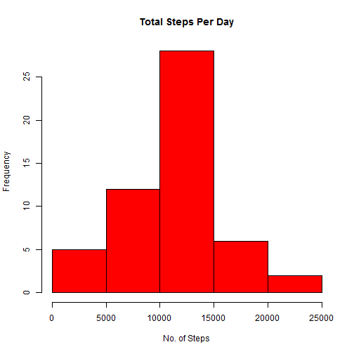
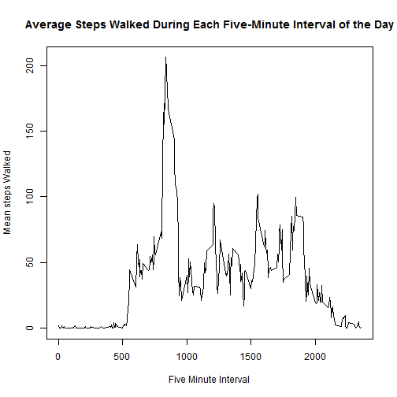
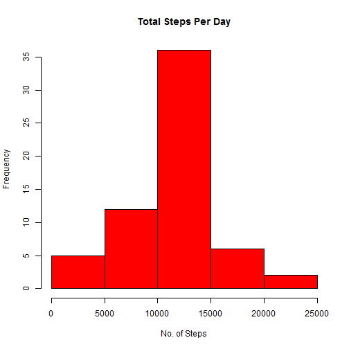
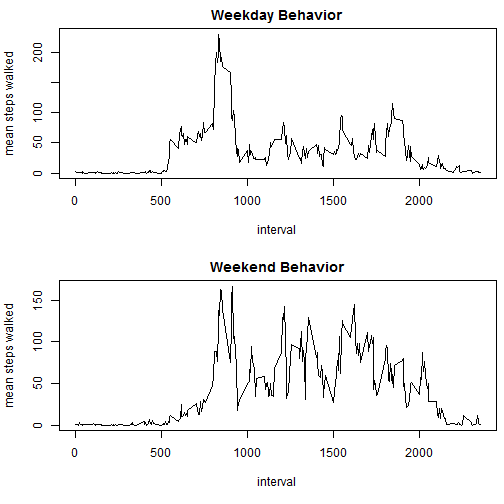

Activity Monitoring Data Analysis
=================================

This report discusses key statistics and trends pertaining to the Activity Monitoring data set.  This data set consists of the number of steps taken within various five-minute intervals throught each day, over a two-month period.  There are 17,568 observations within this data set.

##Loading the Data

The raw data exists in a .csv file. 


```r
raw<-read.csv("activity.csv")
```

After reading it in, the values in the data column were converted to a "date" class


```r
raw[,2]<-as.Date(raw[,2])
```

##Average total number of steps taken per day

Intervals in which data isn't available were removed from this portion of the analysis


```r
no_na<-raw[is.na(raw$steps)==0,]
```

Next, the total steps per day were calculated using the ddply function:


```r
library(plyr)
daily_totals<-ddply(no_na,.(date),summarize,sum=sum(steps))
hist(daily_totals$sum,main="Total Steps Per Day",col="red",xlab="No. of Steps")
```

 

```r
meansteps<-mean(daily_totals$sum)
mediansteps<-median(daily_totals$sum)

paste("The mean total steps taken per day is",meansteps)
```

```
## [1] "The mean total steps taken per day is 10766.1886792453"
```

```r
paste("The median total steps taken per day is",mediansteps)
```

```
## [1] "The median total steps taken per day is 10765"
```

##Average Daily Activity Pattern

The average number of steps taken during each 5-minute interval of each day is as follows:


```r
interval_avg<-ddply(no_na,.(interval),summarize,sum=mean(steps))
plot(interval_avg$interval,interval_avg$sum,xlab="Five Minute Interval",ylab="Mean steps Walked",main="Average Steps Walked During Each Five-Minute Interval of the Day",type="l")
```

 

```r
max_steps<-interval_avg[interval_avg$sum==max(interval_avg$sum),2]
paste("The interval with the highest average number of steps is",interval_avg[interval_avg$sum==max_steps,1])
```

```
## [1] "The interval with the highest average number of steps is 835"
```

##Average total number of steps taken per day, with N/A rows filled in

Any rows for which total steps weren't available were filled with the average number of steps taken during the interval in question.  For example, if the "20" interval on a particular day weren't available, then the code below would replace the N/A with the average number of steps taken during the "20" intervals on the other days.


```r
num_nas<-sum(is.na(raw$steps))
paste("the number of missing values in the dataset is",num_nas)
```

```
## [1] "the number of missing values in the dataset is 2304"
```

```r
fill_na<-raw
    
    for(i in 1:length(fill_na[,1]))
    {
        if(is.na(fill_na[i,1]))
        {
            fill_na[i,1]<-interval_avg[interval_avg$interval==fill_na[i,3],2]
        }
    }
```

A revised histogram of this new dataset is as follows:

```r
daily_totals_fill<-ddply(fill_na,.(date),summarize,sum=sum(steps))
hist(daily_totals_fill$sum,main="Total Steps Per Day",col="red",xlab="No. of Steps")
```

 

```r
meansteps<-mean(daily_totals_fill$sum)
mediansteps<-median(daily_totals_fill$sum)
paste("The mean total steps taken per day is",meansteps)
```

```
## [1] "The mean total steps taken per day is 10766.1886792453"
```

```r
paste("The median total steps taken per day is",mediansteps)
```

```
## [1] "The median total steps taken per day is 10766.1886792453"
```

The revised histogram clearly contains more days in the 10,000 to 15,000 bucket than the original histogram did.  However, the mean and median numbers of steps don't differ significantly between the data with the N/As removed and the data with the N/As filled in.

##Activity Differences Between Weekdays and Weekends

This portion of the analysis aims to determine whether movement behavior differs between weekdays and weekends.  The factor variable below divides the dataset into weekdays and weekends;

```r
day_of_week_table<-fill_na
day_of_week_table[,2]<-weekdays(day_of_week_table[,2])
weekend_flag<-rep("Weekday",length(day_of_week_table[,2]))
for(i in 1:length(day_of_week_table[,2]))
    {
        if(day_of_week_table[i,2]=="Saturday"|day_of_week_table[i,2]=="Sunday")
        {
            weekend_flag[i]="Weekend"
        }
    
        else
        {
            weekend_flag[i]="Weekday"
        }
        
    }
day_of_week_table<-cbind(day_of_week_table,weekend_flag)
day_of_week_table$weekend_flag<-factor(day_of_week_table$weekend_flag)
```

Finally, the following plot illustrates the average number of steps taken per interval within the weekday and weekend data sets:


```r
par(mar=c(5.1,4.1,2.0,0.5))
weekdaybreakout<-aggregate(steps~interval+weekend_flag,data=day_of_week_table,mean)
par(mfcol=c(2,1))
plot(weekdaybreakout[weekdaybreakout$weekend_flag=="Weekday",1],weekdaybreakout[weekdaybreakout$weekend_flag=="Weekday",3],xlab="interval",ylab="mean steps walked",main="Weekday Behavior",type="l")
plot(weekdaybreakout[weekdaybreakout$weekend_flag=="Weekend",1],weekdaybreakout[weekdaybreakout$weekend_flag=="Weekend",3],xlab="interval",ylab="mean steps walked",main="Weekend Behavior",type="l")
```

 

The mean steps in both datasets peaks between the 500 and 1000 intervals, but the weekend dataset shows significantly more activity in the higher intervals than the weekday dataset does.
